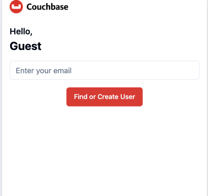
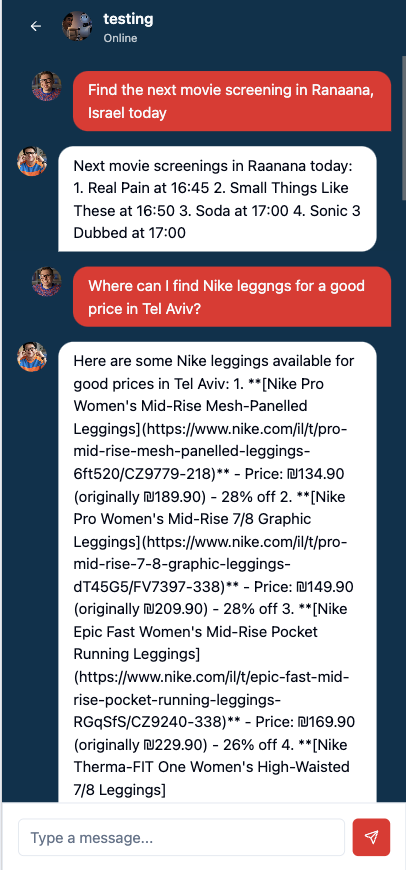

# Couchbase Open Source Browser Agent Web UI

This repository contains a full-stack web application that demonstrates how to use the popular [Browser Use](https://browser-use.com/) open source library to enable AI to control a browser to perform complex tasks with Couchbase powering data storage, retrieval and search.

The backend is a FastAPI application using uvicorn as the web server implementation and leveraging the Browser Use Python SDK. The frontend is a Vite application using React and Tailwind. You can find the respective instructions for each part of the application below.

> [!IMPORTANT]
> This sample application **does not** have authentication or authorization mechanisms. It is recommended to add these mechanisms before deploying to production.
> The code is provided to demonstrate how to build a full-stack application using the Browser Use library and Couchbase, and **is not** intended to be used in production as is.


## Backend

### Installation

1. Install the dependencies:

```bash
pip install -r requirements.txt
```

2. Provide the necessary environment variables:

```bash
OPENAPI_API_KEY=
COUCHBASE_CONNECTION_STRING=your-connection-string-url
COUCHBASE_BUCKET=your-bucket-name
COUCHBASE_USERNAME=your-username
COUCHBASE_PASSWORD=your-password
```

There is a sample `.env` file that you can use to set the environment variables. Simply rename the provided `.env.example` to `.env` and fill in the necessary values.

3. Run the application:

```bash
uvicorn main:app --reload
```

The backend will be running on `http://localhost:8000`.

### Routes

The backend has defined routes for the AI agent, the chat interface and user management.

#### Users

- `POST` `/users/`: Create a new user.
- `GET` `/users/{user_id}`: Get a user by ID.
- `GET` `/users/{user_id}/chats`: Get all chats for a user.

#### Chats

- `POST` `/chats/`: Create a new chat.
- `GET` `/chats/{chat_id}`: Get a chat by ID.
- `GET` `/chats/{chat_id}/messages`: Get all messages for a chat.
- `GET` `/users/{user_id}/chats/search`: Search for chats by user ID.

#### Agent

- `POST` `/run-agent`: Run the AI agent to perform a task.

## Frontend

### Installation

1. Install the dependencies:

```bash
npm install
```

2. Run the application:

```bash
npm run dev
```

The frontend will be running on `http://localhost:5173`.

### Routes

The frontend has a single route for the chat interface and can be accessed at `http://localhost:5173`.

### User Interface

The user is first prompted to enter their email address to either fetch or create a user from the Couchbase data store. Once the user is created or fetched, the user is redirected to the chat interface where they can interact with the AI agent.



Once the user is created or fetched, the user is redirected to the list of their current chats with the AI agent. If there are no chats, they are prompted to create their first chat.


The chat interface allows users to ask the AI agent any request, and the agent will open up a browser independently and perform up to a pre-defined number of steps (configurable inside `backend/tasks/agent_runner.py`) to fulfill the request. These tasks can range from determining the weather in a specific location to finding the best flight deals for an upcoming trip to booking a dinner reservation at a local restaurant.



## License

This project is licensed under the MIT License - see the [LICENSE](LICENSE) file for details.


